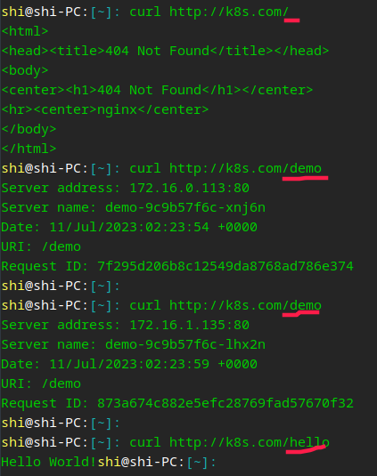

[GitHub](https://github.com/shigebeyond/K8sBoot) | [Gitee](https://gitee.com/shigebeyond/K8sBoot)

# K8sBoot - 简化k8s资源定义文件

## 1 概述
k8s太复杂了，特别是资源定义文件，学习与使用成本很高，大部分伙伴很难学会，因此创作了K8sBoot工具，支持通过简化版的yaml配置来生成k8s最终的资源定义文件，yaml的代码量大大缩小；

框架通过编写简单的yaml, 就可以执行一系列复杂的操作步骤, 如打印变量/生成rc/rs/deploy等资源文件，极大的简化了伙伴编写k8s资源定义文件的工作量与工作难度，大幅提高人效；

框架通过提供类似python`for`/`if`/`break`语义与变量赋值等步骤动作，赋予伙伴极大的开发能力，让资源定义文件的编写工作更具灵活性，能适用于广泛的应用场景。

框架提供`include`机制，用来加载并执行其他的步骤yaml，一方面是功能解耦，方便分工，一方面是功能复用，提高效率与质量，从而推进脚本整体的工程化。

## 2 特性
1. 支持通过yaml来配置执行的步骤，简化了生成代码的开发:
每个步骤可以有多个动作，但单个步骤中动作名不能相同（yaml语法要求）;
动作代表k8s的某个资源定义，如config/rc/rs/deploy等等;
2. 支持类似python`for`/`if`/`break`语义的步骤动作，灵活适应各种场景
3. 支持`include`引用其他的yaml文件，以便解耦与复用
4. 增加了`应用`(即`app`)的概念，为k8s资源定义增加了面向应用编程的方式，更加切合应用维度的部署与管理需求
5. yaml的代码量大大缩小，K8sBoot的yaml代码量相当于k8s资源文件的1/4~1/10

## 3 搭配k8s命令简化框架，使用更简单
[k8scmd](https://github.com/shigebeyond/k8scmd)：对k8s的复杂命令做了大量简化

## 4 同类yaml驱动框架
[HttpBoot](https://github.com/shigebeyond/HttpBoot)
[SeleniumBoot](https://github.com/shigebeyond/SeleniumBoot)
[AppiumBoot](https://github.com/shigebeyond/AppiumBoot)
[MiniumBoot](https://github.com/shigebeyond/MiniumBoot)
[ExcelBoot](https://github.com/shigebeyond/ExcelBoot)
[MonitorBoot](https://github.com/shigebeyond/MonitorBoot)

## 5 todo
1. 支持更多的动作

## 6 安装
```
pip3 install K8sBoot
```

安装后会生成命令`K8sBoot`;

注： 对于深度deepin-linux系统，生成的命令放在目录`~/.local/bin`，建议将该目录添加到环境变量`PATH`中，如
```
export PATH="$PATH:/home/shi/.local/bin"
```

## 7 使用
```
# 1 执行单个文件
K8sBoot 步骤配置文件.yml

# 2 执行多个文件
K8sBoot 步骤配置文件1.yml 步骤配置文件2.yml ...

# 3 执行单个目录, 即执行该目录下所有的yml文件
K8sBoot 步骤配置目录

# 4 执行单个目录下的指定模式的文件
K8sBoot 步骤配置目录/step-*.yml
```

如执行 `K8sBoot example/ingress/1hello.yml -o data/`，输出如下
```
shi@shi-PC:[~/code/python/K8sBoot]: K8sBoot example/ingress/1hello.yml -o data/
2023-07-10 18:29:02,857 - ThreadPoolExecutor-0_0        - boot - DEBUG - Load and run step file: /home/shi/code/python/K8sBoot/example/ingress/1hello.yml
2023-07-10 18:29:02,860 - ThreadPoolExecutor-0_0        - boot - DEBUG - handle action: app(hello)=[{'containers': {'hello': {'image': 'registry.cn-hangzhou.aliyuncs.com/lfy_k8s_images/hello-server', 'ports': ['8000:9000']}}}, {'deploy': {'replicas': 2}}]
2023-07-10 18:29:02,860 - ThreadPoolExecutor-0_0        - boot - DEBUG - handle action: containers={'hello': {'image': 'registry.cn-hangzhou.aliyuncs.com/lfy_k8s_images/hello-server', 'ports': ['8000:9000']}}
2023-07-10 18:29:02,860 - ThreadPoolExecutor-0_0        - boot - DEBUG - handle action: deploy={'replicas': 2}
2023-07-10 18:29:02,862 - ThreadPoolExecutor-0_0        - boot - INFO - App[hello]的资源定义文件已生成完毕, 如要更新到集群中的资源请手动执行: kubectl apply --record=true -f /home/shi/code/python/K8sBoot/data
```
命令会自动操作并生成k8s资源文件
```
shi@shi-PC:[~/code/python/K8sBoot]: tree data
data
├── hello-deploy.yml
└── hello-svc.yml
```

## 8 步骤yaml详解
支持通过yaml文件来配置执行的步骤;

每个步骤可以有多个动作，但单个步骤中动作名不能相同（yaml语法要求）;

动作代表k8s上的一种操作，如config/rc/rs/deploy等等;

下面详细介绍每个动作

### 8.1 基本动作
1. ns：设置与生成 namespace 资源
```yaml
ns: 命名空间名
```

2. app：生成应用，并执行子步骤
```yaml
# 如果应用名以@开头, 表示应用名也作为pod的主机名
# 如果应用名以-结尾，表示应用名作为资源名前缀，在创建资源时自动生成资源名
app(应用名):
    # 子步骤
    - config:
        auther: shigebeyond
```

3. cname：为外部域名设置别名，会生成 ExternalName 类型的 Service 资源
```yaml
cname:
  # 别名: 外部域名
  baidu: www.baidu.com # 外部域名
  sk: www.shikee.com
  example-test: jkmvc-example.test.svc.cluster.local:8080 # 其他命名空间中的服务, 带端口
```
cname可结合ingress
```yaml
# 自己配host, 测试: curl example-test.k8s.com
- app(example-test):
  - cname:
      example-test: jkmvc-example.test.svc.cluster.local # 其他命名空间中的服务, 不带端口
  - ingress:
      # url对转发的(服务)端口映射，支持字典树形式
      example-test.k8s.com:
          /: example-test:8080 # 指定cname服务端口
```

4. print: 打印, 支持输出变量/函数; 
```yaml
# 调试打印
print: "总申请数=${dyn_data.total_apply}, 剩余份数=${dyn_data.quantity_remain}"
```

5. set_vars: 设置变量; 
```yaml
set_vars:
  name: shi
  password: 123456
  birthday: 5-27
```

6. print_vars: 打印所有变量; 
```yaml
print_vars:
```

7. for: 循环; 
for动作下包含一系列子步骤，表示循环执行这系列子步骤；变量`for_i`记录是第几次迭代（从1开始）,变量`for_v`记录是每次迭代的元素值（仅当是list类型的变量迭代时有效）
```yaml
# 循环3次
for(3) :
  # 每次迭代要执行的子步骤
  - print: $for_v

# 循环list类型的变量urls
for(urls) :
  # 每次迭代要执行的子步骤
  - print: $for_v

# 无限循环，直到遇到跳出动作
# 有变量for_i记录是第几次迭代（从1开始）
for:
  # 每次迭代要执行的子步骤
  - break_if: for_i>2 # 满足条件则跳出循环
    print: $for_v
```

8. once: 只执行一次，等价于 `for(1)`; 
once 结合 moveon_if，可以模拟 python 的 `if` 语法效果
```yaml
once:
  # 每次迭代要执行的子步骤
  - moveon_if: for_i<=2 # 满足条件则往下走，否则跳出循环
    print: $for_v
```

9. break_if: 满足条件则跳出循环; 
只能定义在for/once循环的子步骤中
```yaml
break_if: for_i>2 # 条件表达式，python语法
```

10. moveon_if: 满足条件则往下走，否则跳出循环; 
只能定义在for/once循环的子步骤中
```yaml
moveon_if: for_i<=2 # 条件表达式，python语法
```

11. if/else: 满足条件则执行if分支，否则执行else分支
```yaml
- set_vars:
    txt: '进入首页'
- if(txt=='进入首页'): # 括号中包含的是布尔表达式，如果表达式结果为true，则执行if动作下的子步骤，否则执行else动作下的子步骤
    - print: '----- 执行if -----'
  else:
    - print: '----- 执行else -----'
```

12. include: 包含其他步骤文件，如记录公共的步骤，或记录配置数据(如用户名密码); 
```yaml
include: part-common.yml
```

### 8.2 app作用域下的子动作
以下的动作，必须声明在app动作的子步骤中，动作的参数支持传递变量;

这种设计隐藏了k8s资源定义规范: 
```
1 一般资源都需要放到app作用域下, 即资源的label=app名, 代表一组资源组成了一个app。
一般资源是指: config/secret/pod/rc/rs/ds/sts/deploy/service/job/cronjob/hpa/ingress/svc，以应用作为管理粒度。
2 一般资源的资源名=app名, 除了以下情况的service资源
2.1 ClusterIP类型的service资源名=app名
2.2 如果不存在ClusterIP类型的service资源，则其他类型的service资源名=app名
2.3 如果存在ClusterIP类型的service资源，则NodePort类型的service资源名=app名-np，LoadBalancer类型的service资源名=app名-lb
```

13. labels：设置应用标签
```yaml
labels: 
    env: prod
    env2: $env # 支持传递变量
```

14. config：以键值对的方式来设置 Config 资源
```yaml
config:
    auther: shigebeyond
```

15. config_from_files：以文件内容的方式来设置 Config 资源，在挂载configmap时items默认填充用config_from_files()写入的key
```yaml
# 读配置文件内容作为配置项
- config_from_files: ./default.conf # 单个文件, 文件名作为配置名, 文件内容作为配置值
- config_from_files: ./conf/ # 目录, 遍历目录下的所有文件作为配置项
- config_from_files: # 文件list, 遍历所有文件作为配置项
    - ./default.conf
    - ./index.html
- config_from_files: # 文件dict，key是配置名，value是文件路径
    default.conf: ./default.conf
```

16. secret：以键值对的方式来设置 Secret 资源
```yaml
secret:
    auther: c2hpZ2ViZXlvbmQK
```

17. secret_files：以文件内容的方式来设置 Secret 资源，在挂载secret时items默认填充用secret_files()写入的key
```yaml
config_from_files: # secret文件
    - ./admin.conf
```

18. containers：设置容器，用于生成资源 pod / ReplicationController / ReplicaSet / DaemonSet / StatefulSet / Deployment / Job / Cronjob / HorizontalPodAutoscaler 文件中的 `spec.containers` 元素
```yaml
containers:
    nginx: # 定义多个容器, dict形式, 键是容器名, 值是容器配置
      image: nginx # 镜像
      env: # 以dict方式设置环境变量
        TZ: Asia/Shanghai
        # 引用pod信息
        POD_NAME: ${ref_pod_field(metadata.name)}
        POD_NAMESPACE: ${ref_pod_field(metadata.namespace)}
        POD_IP: ${ref_pod_field(status.podIP)}
        # 引用容器资源信息
        CPU_MIN: ${ref_resource_field(requests.cpu)}
        CPU_MAX: ${ref_resource_field(limits.cpu)}
        MEM_MIN: ${ref_resource_field(requests.memory)}
        MEM_MAX: ${ref_resource_field(limits.memory)}
        # 引用配置
        AUTHOR: ${ref_config(auther)}
      env_from: # 从当前应用的 config 或 secret 资源中导入环境变量
        - config
        #- config:xxx # 引用其他应用xxx的配置
        #- secret
      ports: # 端口映射
        - 80 # 容器端口
        #- 30000:80 # 服务端口:容器端口
        #- 30000:30000:80 # 宿主机端口:服务端口:容器端口
        #- udp://30000:80 # 前面加协议，默认tcp
      volumes: # 卷映射
        - /var/log/nginx
        #- /lnmp/www:/www
        - config://:/www # 挂载configmap所有key到目录
        - config://default.conf:/etc/nginx/conf.d/default.conf # 挂载configmap单个key到文件
        #- config://xxx/default.conf:/etc/nginx/conf.d/default.conf -- 挂载其他应用xxx的configmap
        - downwardAPI://:/etc/podinfo # 将元数据labels和annotations以文件的形式挂载到目录
        - downwardAPI://labels:/etc/podinfo2/labels.properties # 将元数据labels挂载为文件
        #- pvc://pvc1:/usr/share/nginx/html # 将pvc挂载为目录
      # 启动命令：命令改写后导致nginx自身服务没起来，应该是覆盖了nginx镜像自身的启动命令
      #command: sed -i 's/POD_IP/\$POD_IP/g' /www/index.html; tail -f /etc/profile
      #command: while true;do echo hello;sleep 1;done # 死循环维持pod运行
      ready?: # 就绪态
        # 各种秒数
        #seconds: initialDelaySeconds=5 periodSeconds=5 timeoutSeconds=5 successThreshold=1 failureThreshold=5 # 全写
        seconds: i=5 p=5 t=5 s=1 f=5 # 简写
        # 动作
        action: ls /etc/nginx/
      live?: # 存活性探针
        # 各种秒数
        #seconds: initialDelaySeconds=5 periodSeconds=5 timeoutSeconds=5 successThreshold=1 failureThreshold=5 # 全写
        seconds: i=5 p=5 t=5 s=1 f=5 # 简写
        # 动作
        action: http://localhost:80 # 在pod中执行，请使用容器端口
      resources: # 资源
        cpu: 0.01 # 最小值
        #cpu: 0.01~0.02 # 最小值~最大值
        memory: 50Mi
```

19. initContainers：设置初始化容器，用于生成资源 pod / ReplicationController / ReplicaSet / DaemonSet / StatefulSet / Deployment / Job / Cronjob / HorizontalPodAutoscaler 文件中的 `spec.initContainers` 元素
```yaml
initContainers:
  # 参数跟 containers 动作一样
  init:
    #image: busybox # 镜像可省，默认为busybox
    command: chmod 0777 /usr/share/filebeat/data
    volumes:
      - /data/filebeat:/usr/share/filebeat/data
```

20. pod：生成 pod 资源
```yaml
pod:
```

21. deploy：生成 Deployment 资源
```yaml
deploy:
    replicas: 1 # 副本数
# 简写
deploy: 1

# 更详细的参数
deploy:
    #hostname: nginx # 设置pod的主机名
    #hostname:  # 设置pod的主机名，如果不赋值，则默认取app名
    replicas: 2 # 副本数
    nodeSelector: # 节点选择: dict形式
      kubernetes.io/os: linux
    nodeAffinity:
      require: # requiredDuringSchedulingIgnoredDuringExecution简写
        - kubernetes.io/os in linux # 标签选择的表达式
      prefer: # preferredDuringSchedulingIgnoredDuringExecution简写
        - kubernetes.io/os in linux
      weight: 1
    podAffinity:
      require: # requiredDuringSchedulingIgnoredDuringExecution简写
        - app = nginx
      prefer: # preferredDuringSchedulingIgnoredDuringExecution简写
        - app = nginx
      weight: 1
      tkey: kubernetes.io/hostname # topologyKey简写
    podAntiAffinity:
      require: # requiredDuringSchedulingIgnoredDuringExecution简写
        - app = xxx
      prefer: # preferredDuringSchedulingIgnoredDuringExecution简写
        - app = xxx
      weight: 1
      tkey: kubernetes.io/hostname # topologyKey简写
    tolerations: # 容忍
      - node-role.kubernetes.io/master:NoSchedule
      - node-role.kubernetes.io/control-plane:NoSchedule
```

22. rc：生成 ReplicationController 资源
```yaml
rc:
    replicas: 1 # 副本数
# 简写
rc: 1
# 更详细的参数：参考 deploy 动作
```

23. rs：生成 ReplicaSet 资源
```yaml
rs:
    replicas: 1 # 副本数
# 简写
rs: 1
# 更详细的参数：参考 deploy 动作
```

24. ds：生成 DaemonSet 资源
```yaml
ds:
# 更详细的参数：参考 deploy 动作
```

25. sts：生成 StatefulSet 资源
```yaml
sts:
    replicas: 1 # 副本数
# 简写
sts: 1
# 更详细的参数：参考 deploy 动作
```

26. job：生成 Job 资源:
完整写法
```yaml
- app(counter):
    - containers:
        counter:
          image: busybox
          command: 'for i in 9 8 7 6 5 4 3 2 1; do echo \$i;sleep 2;done'
    # 任务
    - job:
        completions: 2 # job需要成功运行 Pods 的次数。默认为1
        parallelism: 2 # job在任一时刻应该并发运行 Pods 的数量。默认为1，如果上面的 completions 为 6 ，这个参数为 3 ，表示有 6 个 pod，允许有 3 个 pod 并发运行
        activeDeadlineSeconds: 30 # job可运行的时间期限，超过时间还未结束，系统将会尝试进行终止。
        backoffLimit: 3 # job失败后进行重试的次数。默认为6
```
简写
```yaml
- app(counter):
    # 任务
    - job:
        completions: 2 # job需要成功运行 Pods 的次数。默认为1
        parallelism: 2 # job在任一时刻应该并发运行 Pods 的数量。默认为1，如果上面的 completions 为 6 ，这个参数为 3 ，表示有 6 个 pod，允许有 3 个 pod 并发运行
        activeDeadlineSeconds: 30 # job可运行的时间期限，超过时间还未结束，系统将会尝试进行终止。
        backoffLimit: 3 # job失败后进行重试的次数。默认为6
        # 任务命令：当没有声明容器时，它会自动构建一个busybox的container来运行命令
        command: 'for i in 9 8 7 6 5 4 3 2 1; do echo \$i;sleep 2;done'
```

27. cronjob：生成 Cronjob 资源:
完整写法
```yaml
- app(clock):
    - containers:
        clock:
          image: busybox
          command: 'date'
    # 定时任务
    - cronjob:
        schedule: "*/1 * * * *"
```
简写
```yaml
- app(clock):
    # 定时任务
    - cronjob:
        schedule: "*/1 * * * *"
        # 任务命令：当没有声明容器时，它会自动构建一个busybox的container来运行命令
        command: 'date'
```

28. hpa：生成 HorizontalPodAutoscaler 资源
```yaml
hpa:
    by: # 扩容的度量指标
      memory: 50% # 尾部带%表示用使用率(百分比)，否则用使用量(绝对值)
      cpu: 50%
    deploy: # 部署相关的子动作，可以是 rc/rs/deploy 等
      replicas: 1~3 # 副本数的最小值+最大值，应用在hpa
```

29. ingress：生成 Ingress 资源
```yaml
ingress:
    # url对转发的(服务)端口映射，支持字典树形式
    http://k8s.com/a: 80 # 当前应用的服务端口
    http://k8s.com/b: nginx:80 # 指定应用的服务端口
    http://k8s.com/c: nginx # 指定应用的第一个服务端口
    # 等价于
    http://k8s.com:
      /a: 80 # 当前应用的服务端口
      /d: nginx:80 # 指定应用的服务端口
      /c: nginx # 指定应用的第一个服务端口
      
    # 路径重写，如果是/api/hello，则去掉前缀api，访问服务的/hello，网关一般这么搞
    http://k8s.com/api(/|$)(.*): 80  
```

默认后端服务
```yaml
ingress: nginx:80 # 直接int或str
```

30. ingress_by_cookie: 基于 Cookie 的流量切分，适用于灰度发布与 A/B 测试
```
# K8sBoot/example/ingress-by-cookie/gateway-by-cookie.yml
# 测试： curl --cookie "test=always" http://canary.com
- include: ../ingress/1hello.yml
- include: ../ingress/2demo.yml
- app(gateway-prod):
    - ingress:
        canary.com: hello
- app(gateway-grey):
    - ingress_by_cookie(test):
        canary.com: demo
```

31. ingress_by_header: 基于 Request Header 的流量切分，适用于灰度发布以及 A/B 测试
```
# K8sBoot/example/ingress-by-header/gateway-by-header.yml
# 测试：curl -H "Region: cd" http://canary.com
- include: ../ingress/1hello.yml
- include: ../ingress/2demo.yml
- app(gateway-prod):
    - ingress:
        canary.com: hello
- app(gateway-grey):
    - ingress_by_header(Region=cd):
        canary.com: demo
```

32. ingress_by_weight: 基于服务权重的流量切分，适用于蓝绿部署
```
# K8sBoot/example/ingress-by-weight/gateway-by-weight.yml
# 测试： for i in {1..10}; do  curl http://canary.com/; done;
- include: ../ingress/1hello.yml
- include: ../ingress/2demo.yml
- app(gateway-green):
    - ingress:
        canary.com: hello
- app(gateway-blue):
    - ingress_by_weight(50):
        canary.com: demo
```

33. pvc: 生成pvc资源
```
- pvc: # 创建pvc
    size: 100Mi # 存储大小
    #storageClassName: xxx # 存储类型，可省(用集群的默认存储类)
    #accessModes: ['ReadWriteOnce'] # 访问模式，可省默认为['ReadWriteOnce']
```

## 9 demo
示例见源码 [example](example) 目录，接下来以 [example/ingress](example/ingress) 为案例讲解下 K8sBoot 与 [k8scmd](https://github.com/shigebeyond/k8scmd) 的使用:

1. 目录结构
```
shi@shi-PC:[~/code/python/K8sBoot]: tree example/ingress/
example/ingress/
├── 1hello.yml
├── 2demo.yml
└── 3gateway.yml
```

2. 步骤yaml
```yaml
# 1hello.yml
- app(hello):
    - containers:
        hello:
          image: registry.cn-hangzhou.aliyuncs.com/lfy_k8s_images/hello-server
          ports: # 端口映射
            - 8000:9000 # 服务端口:容器端口
    # 部署
    - deploy:
        replicas: 2 # 副本数
# 2demo.yml
- app(demo):
    - containers:
        demo:
          image: nginxdemos/hello:plain-text
          ports: # 端口映射
            - 8001:80 # 服务端口:容器端口
    # 部署
    - deploy:
        replicas: 2 # 副本数
# 3gateway.yml
- app(gateway):
    - ingress:
        # url对转发的(服务)端口映射，支持字典树形式
        k8s.com:
            /hello: hello:8000 # 指定应用的服务端口
            /demo: demo:8001
```

3. 生成k8s资源文件
```sh
K8sBoot example/ingress/ -o data
```
生成的文件如下:
```
shi@shi-PC:[~/code/python/K8sBoot]: tree data/
data/
├── demo-deploy.yml
├── demo-svc.yml
├── gateway-ingress.yml
├── hello-deploy.yml
└── hello-svc.yml
```
生成的文件内容，其代码量是K8sBoot的yaml代码量的4.4倍
```yaml
# demo-deploy.yml
apiVersion: apps/v1
kind: Deployment
metadata:
  labels: &id001
    app: demo
  name: demo
spec:
  replicas: 2
  selector:
    matchLabels: *id001
  template:
    metadata:
      labels: *id001
    spec:
      containers:
      - image: nginxdemos/hello:plain-text
        imagePullPolicy: IfNotPresent
        name: demo
        ports:
        - containerPort: 80
      restartPolicy: Always
      volumes: []
---
# demo-svc.yml
apiVersion: v1
kind: Service
metadata:
  labels: &id001
    app: demo
  name: demo-svc-vip
spec:
  ports:
  - name: p80
    port: 8001
    protocol: TCP
    targetPort: 80
  selector: *id001
  type: ClusterIP
status:
  loadBalancer: {}
---
# hello-deploy.yml
apiVersion: apps/v1
kind: Deployment
metadata:
  labels: &id001
    app: hello
  name: hello
spec:
  replicas: 2
  selector:
    matchLabels: *id001
  template:
    metadata:
      labels: *id001
    spec:
      containers:
      - image: registry.cn-hangzhou.aliyuncs.com/lfy_k8s_images/hello-server
        imagePullPolicy: IfNotPresent
        name: hello
        ports:
        - containerPort: 9000
      restartPolicy: Always
      volumes: []
---
# hello-svc.yml
apiVersion: v1
kind: Service
metadata:
  labels: &id001
    app: hello
  name: hello-svc-vip
spec:
  ports:
  - name: p9000
    port: 8000
    protocol: TCP
    targetPort: 9000
  selector: *id001
  type: ClusterIP
status:
  loadBalancer: {}
---
# gateway-ingress.yml
apiVersion: networking.k8s.io/v1
kind: Ingress
metadata:
  labels:
    app: gateway
  name: gateway
spec:
  ingressClassName: nginx
  rules:
  - host: k8s.com
    http:
      paths:
      - backend:
          service:
            name: hello-svc-vip
            port:
              number: 8000
        path: /hello
        pathType: Prefix
      - backend:
          service:
            name: demo-svc-vip
            port:
              number: 8001
        path: /demo
        pathType: Prefix
  tls: []
```

4. 应用k8s资源文件
```sh
kubectl apply --record=true -f data/
```

5. 查看pod


   
6. 查看service


7. 访问service url


8. 查看ingress


9. 访问ingress

